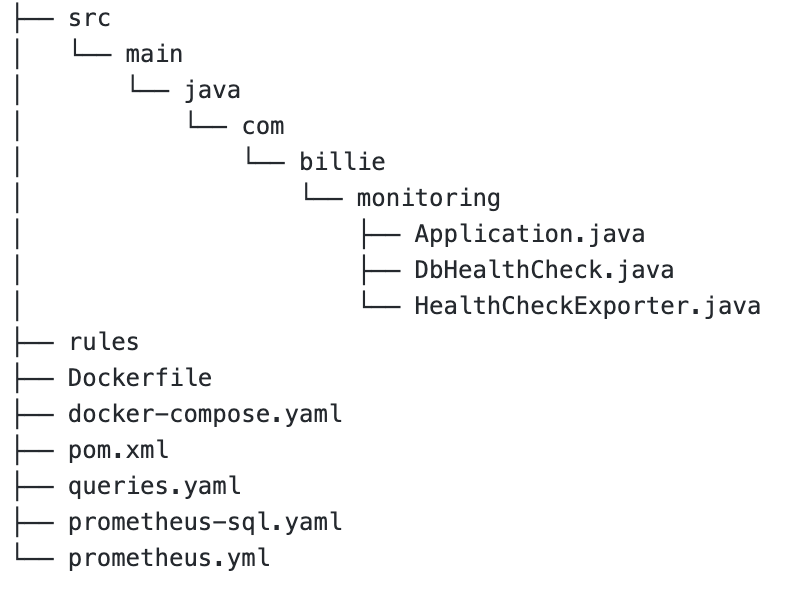

# java-app-healthcheck-prometheus
java-app-healthcheck-prometheus

# Stack

Java
Prometheus
Grafana
MySQL
Docker Compose

# Project structure

# Project dependencies

pom.xml

# Attempted Application architecture design:

# Application URL's 
   ( after running docker-compose up )
   
 1. MYSQL Adminer dashboard: http://localhost:8082/
 2. Prometheus: http://localhost:9090/
 3. Grafana: http://localhost:3000/
 4. App Metrics: http://localhost:8080/metrics
 
